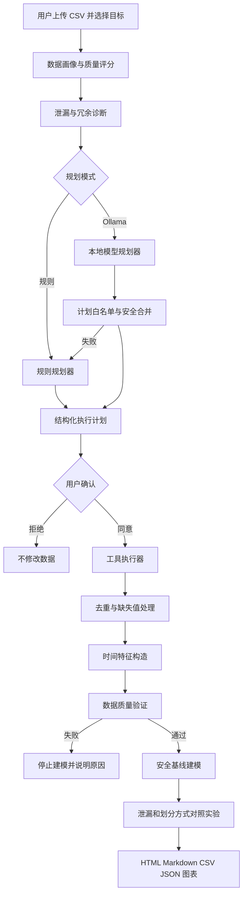

# 系统架构

## 设计目标

系统用于演示如何把自然语言任务规划与确定性数据工具结合。大模型不直接修改 DataFrame，也不能生成并执行任意 Python 代码。

## 分层职责

### 交互层

`app.py`负责数据上传、目标选择、风险展示、计划确认、结果解释和文件下载。

### Agent层

- `RulePlanner`根据实际数据问题生成稳定计划。
- `OllamaPlanner`允许本地模型改写任务理由和允许参数。
- `HybridPlanner`在Ollama不可用或输出不合规时自动回退。
- `ExecutionPlan.validate`限制工具白名单、数据划分方式和必要步骤顺序。

### 确定性工具层

- `profiling.py`：数据画像和质量评分。
- `diagnostics.py`：目标泄漏、阈值规则和冗余关系。
- `cleaning.py`：去重、缺失值填补和时间特征。
- `validation.py`：重复、缺失、时间和数值范围检查。
- `modeling.py`：预处理Pipeline、分类和回归。
- `experiments.py`：泄漏字段与数据划分对照实验。
- `visualization.py`：可复现图表。
- `reporting.py`：Markdown和HTML报告。

## 安全边界

1. 只允许调用七个白名单工具。
2. Ollama不能删除验证、建模和报告步骤。
3. Ollama不能从排除列表中移除规则系统识别出的泄漏字段。
4. 原始CSV永不覆盖，处理结果写入`outputs`。
5. 数据验证失败时停止建模。
6. 所有模型指标来自scikit-learn实际计算。

## 当前样例的关键证据

拥堵标签与`speed_kmh <= 34.5`完全一致。对照实验使用同一种决策树：

- 包含泄漏字段并随机划分：Accuracy、Precision、Recall、F1均为100%。
- 排除泄漏与冗余字段并随机划分：Accuracy为83.89%。
- 排除泄漏字段并按时间划分：Accuracy为87.78%。

最终推荐结果不使用上述决策树对照指标。正式流程按时间顺序切分训练集、验证集和测试集，在验证集比较Logistic、SVM和决策树后选择逻辑回归，最后一次性评估测试集。
